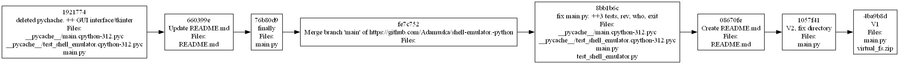
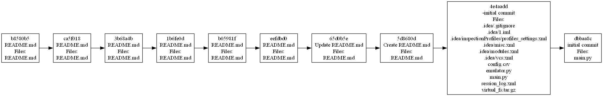

## README

Эта инструмент командной строки для визуализации графа 
зависимостей, включая транзитивные зависимости. Сторонние средства для 
получения зависимостей использовать нельзя.

Зависимости определяются для git-репозитория. Для описания графа 
зависимостей используется представление Mermaid. Визуализатор
выводит результат на экран в виде кода. Построен граф зависимостей для коммитов, в узлах которого содержатся
дата, время и автор коммита. 

Конфигурационный файл имеет формат toml.

## Запуск
Для запуска программы ввод py main.py <cсылку на гитхаб>

## Тестирование
Для проверки было использованно 2 репозитория:

1. https://github.com/JobsLament/shell-emulator.-python.git
2. https://github.com/Mordecai1sg/shell-emulator.git

Граф зависимостей 1 репозитория:

Граф зависимостей 2 репозитория:

Построенные графы соответствуют дейтсивтельности.
